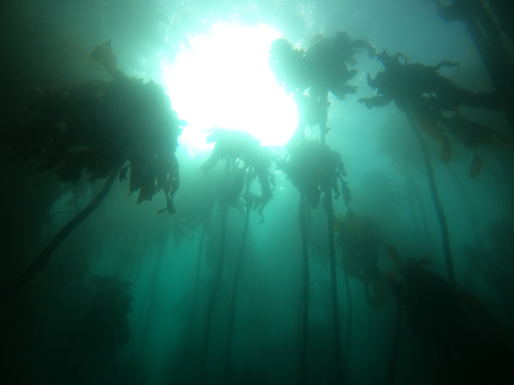

# BioSCape-AVRISNG-KELPS

**Kelp Extraction from L2 Pixel Spectra**

This repository processes AVIRIS-NG L2A and L2B hyperspectral imagery from the [BioSCape](https://www.bioscape.io/data) campaign to identify and stage coastal scenes along South Africa's coastline. It exports georeferenced quicklook products (RGB and NDVI GeoTIFFs) and extracts per-pixel reflectance spectra from kelp annotation polygons for downstream spectral analysis.

 

## Folder Structure

```
BioSCape-AVRISNG_Spectra/
  data/
    rfl_nc/                          # all staged .nc files
    rfl_ocean_subset/                # L2A coastal/ocean .nc files
    rfl_l2b_ocean_subset/            # L2B coastal/ocean .nc files
  SouthAfricaCoastlineMask/          # coastline shapefile for scene selection
  outputs/                           # L2A products
    manifests/
    scenes/<scene_id>/
      quicklooks/   annotations/   exports/   meta/
    figures/
  outputs_l2b/                       # L2B products
    manifests/
    scenes/<scene_id>/
      quicklooks/   annotations/   exports/   meta/
    figures/
```

## Files

| File | Description |
|---|---|
| `BioSCape_AVIRISNG_L2A.ipynb` | L2A workflow: scene discovery, coastline filtering, staging, quicklook export, kelp spectra extraction, and visualization |
| `BioSCape_AVIRISNG_L2B.ipynb` | L2B workflow: matches L2B scenes to the ocean manifest, stages files, copies annotations from L2A, exports quicklooks, extracts spectra, and compares L2A vs L2B |
| `bioscape_rfl_tools.py` | Core library for reading AVIRIS-NG L2A and L2B NetCDF files, CRS handling (including UTM hemisphere correction and GeoTransform coordinate reconstruction), GeoTIFF export, and spectra extraction |
| `extract_kelp_spectra.py` | Standalone script for batch kelp spectra extraction |
| `qc_crs_transforms_metadata.ipynb` | QC notebook: validates CRS, GeoTransforms, pixel values, 8-bit stretch, and processing metadata across all scenes |

## Input Data

This repository works with two levels of AVIRIS-NG surface reflectance from the BioSCape campaign, both containing 425 spectral bands (380-2510 nm at 5 nm intervals) in NetCDF format with UTM projection.

**L2A** is the standard atmospherically corrected surface reflectance produced by JPL. It removes atmospheric effects (water vapor, aerosols) from the raw radiance but does not account for terrain, sun glint, or viewing geometry. Coordinate arrays (`easting`, `northing`) are stored as explicit variables.

**L2B** is an enhanced surface reflectance product produced by Kovach et al. (UW-Madison). It starts from the same L1B radiance data but adds topographic shading correction, sun glint removal, and bidirectional reflectance (BRDF) correction. For coastal kelp work, the glint correction is the most significant improvement. Coordinates are stored implicitly via a `GeoTransform` attribute and reconstructed by `bioscape_rfl_tools`.

The BioSCape (Biodiversity Survey of the Cape) campaign flew AVIRIS-NG over South Africa's coastal and terrestrial ecosystems in October-November 2023. Flight data can be accessed through the [BioSCape Data Portal](https://www.bioscape.io/data).

### South Africa Coastline Shapefile

Scene selection uses a coastline shapefile to identify flight lines that intersect the ocean/coastal zone. The coastline data is from the Global Map dataset produced by South Africa's National Geo-spatial Information (NGI).

> International Steering Committee for Global Mapping & South Africa National Geo-spatial Information. (2016). Coasts, South Africa, 2016 [Shapefile]. Stanford Digital Repository. https://purl.stanford.edu/zj111gb9121

### AVIRIS-NG L2A Data Citation

> Green, R. O., Brodrick, P. G., Chapman, J. W., Eastwood, M., Geier, S., Helmlinger, M., Lundeen, S. R., Olson-Duvall, W., Pavlick, R., Rios, L. M., Thompson, D. R., & Thorpe, A. K. (2023). AVIRIS-NG L2 Surface Reflectance, Facility Instrument Collection, V1 (Version 1). ORNL Distributed Active Archive Center. https://doi.org/10.3334/ORNLDAAC/2110

### AVIRIS-NG L2B Data Citation

> Kovach, K. R., Ye, Z., Frye, H., & Townsend, P. A. (2025). BioSCape: AVIRIS-NG L2B Enhanced Surface Reflectance (Version 1). ORNL Distributed Active Archive Center. https://doi.org/10.3334/ORNLDAAC/2385

The L2B corrections use the FlexBRDF algorithm for BRDF correction (Queally et al., 2022), the Sun-Canopy-Sensor+C algorithm for topographic correction (Soenen et al., 2005), and the method of Gao and Li (2021) for glint correction.

> Queally, N., Ye, Z., Zheng, T., Chlus, A., Schneider, F., Pavlick, R., & Townsend, P. A. (2022). FlexBRDF: A flexible BRDF correction for grouped processing of airborne imaging spectroscopy flightlines. Journal of Geophysical Research: Biogeosciences, 127, e2021JG006622. https://doi.org/10.1029/2021JG006622

### AVIRIS-NG Instrument Reference

> Chapman, J. W., Thompson, D. R., Helmlinger, M. C., Bue, B. D., Green, R. O., Eastwood, M. L., Geier, S., Olson-Duvall, W., & Lundeen, S. R. (2019). Spectral and radiometric calibration of the Next Generation Airborne Visible Infrared Spectrometer (AVIRIS-NG). Remote Sensing, 11(18), 2129. https://doi.org/10.3390/rs11182129

## Workflow

1. **Discover** scan a folder of AVIRIS-NG L2A `.nc` files and summarize spatial metadata
2. **Filter** intersect flight line footprints with a South Africa coastline shapefile to select ocean/coastal scenes
3. **Stage** hardlink or copy selected `.nc` files into `data/rfl_ocean_subset/`
4. **Export quicklooks** for each scene, write 8-bit RGB, float32 NDVI, and 8-bit NDVI GeoTIFFs with correct UTM-South CRS
5. **Annotate** manually draw kelp polygons in ArcGIS/QGIS and save to each scene's `annotations/` folder
6. **Extract spectra** for each annotated scene, rasterize the polygon, filter by NDVI threshold, and write per-pixel spectra to CSV (columns: X, Y, NDVI, wavelength_1, wavelength_2, ...)

## Known Issues

Four L2A scenes from flight line `ang20231029t104631` (segments `_000` through `_003`) were processed by JPL with a development software build (`software_build_version: 010200_rdndev`, `product_version: test`) and exhibit a georeferencing offset relative to basemap imagery. The remaining 46 L2A scenes are production data (`software_build_version: 002`, `product_version: 1`). These four scenes are excluded from the L2B dataset. See the QC notebook for details.

## Requirements

- Python 3.10+
- netCDF4
- numpy
- pandas
- geopandas
- rasterio
- pyproj
- shapely
- folium
- matplotlib
- Pillow
